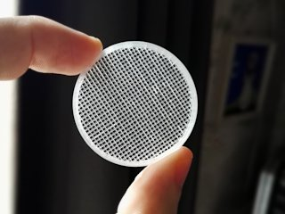
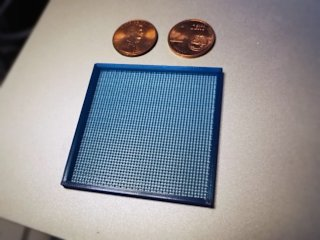
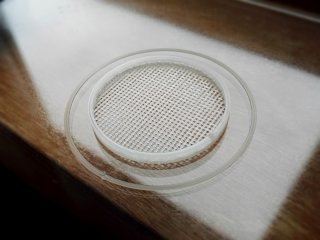

# Customizable sieve / filter / strainer
*3D printable parametric sieve / filter / strainer (formerly thing:2578935)*

### License
[Creative Commons - Attribution](https://creativecommons.org/licenses/by/4.0/)

### Attribution
Based on Sieve (or ‘Seive’) by pcstru ([Thingiverse thing:341357](https://www.thingiverse.com/thing:341357)).

### Gallery

[🔎](images/filter0.jpg) [🔎](images/filter1.jpg) [🔎](images/filter2.jpg)

## Description and Instructions

This is an enhanced and customizable version of the [sieve by pcstru](https://www.thingiverse.com/thing:341357). It allows to make sieves, filters, strainers, or whatever you like to call them, in various shapes and dimensions.

Open the `.scad` file in [OpenSCAD](https://www.openscad.org/) and **[use the OpenSCAD Customizer](https://www.dr-lex.be/3d-printing/customizer.html)** to create a model with your own desired specifications.

Compared to pcstru's original, this updated version allows to choose between round or square shapes, or you can make any regular polygon shape by reducing the number of circle segments. The polygon will fit inside a circle of the specified outer diameter (this means making a 4-sided polygon is not the same as selecting the ‘square’ shape). If you want a rectangular or elliptical shape, use the ‘stretch’ value to extend the shape in one direction.
Another tweak creates the model such that the grid should be well-attached to the rim even when using few or thin strands, and my unstoppable urge for detail made me ensure that the grid is perfectly centered at all times.

You can opt to print the grid as one set of layers, i.e. a plane with holes in it, or to print two sets of strands on top of each other (‘offset’ option). The latter is easier and probably faster to print, and may yield a more accurate filter if hole size is important. The disadvantage is that dirt tends to stick to the filter more easily.

You can also opt to lift the grid. This allows to print accurate filters with strands merely as wide as your nozzle diameter (see photos). Set the lift distance to your *first layer height* to ensure the filter only starts being printed at the *second* layer. This avoids that the strands get squished against the bed, or printed with a wider first layer extrusion, both of which would make the hole size inaccurate. You could also use a raft to the same effect, but it might be difficult to remove the filter form the raft without damaging it.

### Print settings

The examples in the photos were printed at 0.2 mm layers, but any layer height should work. Infill should usually be set to 100% unless you are printing a design with very wide walls or so.

Both prints shown in the photos use 0.4 mm strands (with offset), and were lifted 0.25 mm (first layer height) off the bed.

For filters with narrow strands, you should ensure the extrusion width matches the strand width.

If you are trying to print a filter with a fine mesh that is only 1 extrusion wide, and the mesh disappears entirely when slicing, ensure that slicer options similar to “detect thin walls” are enabled.

## Updates

### 2017/10/10: v2.0

First published to Thingiverse.

### 2020/02/26: v2.1

Added limits and steps to parameters, to make this more usable in the OpenSCAD customizer.
Also allowed to make the outer ring shorter than the grid, or omit it entirely (use a height of 0).

### 2022/03/23: v2.2

Added ‘stretch’ parameter to allow creating elongated shapes (rectangles, ellipses). Refactored the code to be more straightforward.

## Tags
`customizable`, `filter`, `grid`, `mesh`, `openscad`, `sieve`, `strainer`
